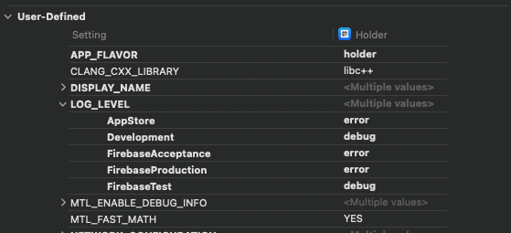

# Logging

A simple logging tool

## Setup

Before we can use the loggin tool, we need to setup the logging level. That is a two step setup. First add an entry in the Info.plist

```xml
	<key>LOG_LEVEL</key>
	<string>${LOG_LEVEL}</string>
```

Second step is adding the LOG_LEVEL as a User-Defined variable to the projects build settings, so you can have different log levels per Configuration (development, acceptance, release etc. )



## Usage

Now we are ready to log!

```swift
import Logging

logVerbose("This is awesome!") // 💤 This is awesome!
logDebug("This is awesome!") // 🐞 This is awesome!
logInfo("This is awesome!") // 📋 This is awesome!
logWarning("This is awesome!") // ❗️ This is awesome!
logError("This is awesome!") // 🔥 This is awesome!
```


The log methods also take a second param of type **Any**. Those values will be printed inline with the message. 

```swift
import Logging

let value = ["foo"]
logDebug("The value is", value // 🐞 The value is: ["foo"]
             
let values: [String] = ["foo", "bar"]
logDebug("The values are", values) // 🐞 The values are: ["foo", "bar"]

let values = ["foo": "bar", "bar": "baz"]
logDebug("The values are", values) // 🐞 The values are: ["bar": "baz", "foo": "bar"]

```

## License

License is released under the EUPL 1.2 license. [See LICENSE](https://github.com/minvws/nl-rdo-app-ios-modules/blob/master/LICENSE.txt) for details.